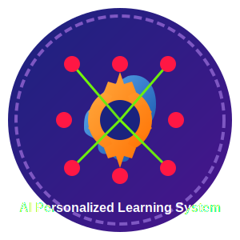

# AI Personalized Learning System

<div align="center">
  
</div>

## 🚀 Overview

A state-of-the-art AI-based personalized learning path recommendation and management system that leverages multimodal data analysis, edge computing, and advanced AI algorithms to provide optimized learning experiences for individuals.

> This repository is based on a patent by Ucaretron Inc. (Inventor: Jee Hwan Jang)

<div align="center">
  
</div>

## ✨ Key Features

- **Multimodal Real-time Data Collection**: Captures biometric signals, behavioral data, and environmental factors through wearable sensors, eye tracking, facial recognition, and IoT devices
- **Advanced AI Learning Analysis**: Utilizes deep learning, reinforcement learning, NLP, and knowledge graphs to build personalized learning models
- **Adaptive Learning Path Generation**: Creates optimized learning paths considering individual characteristics, goals, and learning patterns
- **Real-time Monitoring and Feedback**: Provides immediate feedback based on cognitive load, focus level, and emotional state
- **Personalized Content Generation**: Generates tailored content (text, image, audio, video, AR/VR) using various AI generative technologies
- **Edge-based Context Awareness**: Performs real-time analysis on edge devices to minimize latency
- **Privacy-focused Architecture**: Employs homomorphic encryption, blockchain, and differential privacy for secure data handling
- **Explainable AI**: Provides transparent reasoning for AI decisions

## 🏗️ System Architecture

The system consists of six main components:

1. **Learning Data Collection Unit (110)**: Collects various types of data through sensors and devices
2. **AI Learning Analysis & Path Recommendation Unit (120)**: Analyzes data and recommends optimal learning paths
3. **Learning Content Provision & Management Unit (130)**: Provides personalized learning content and real-time management
4. **User Interface Unit (140)**: Enables interaction between users and the system
5. **Security & Privacy Protection Module (150)**: Ensures data security and privacy
6. **Explainable AI (XAI) Module (160)**: Provides explanations for AI decisions

<div align="center">
  
</div>

## 💻 Technology Stack

- **Communication**: High-speed communication, Edge AI, Bluetooth, WiFi, 5G/6G
- **Hardware**: Ultra-narrow-width semiconductor technology, high-performance AI chips
- **Sensors**: In-ear biometric sensors (EEG, heart rate, temperature), eye tracking, facial recognition, voice recognition
- **AI Algorithms**: Deep learning, reinforcement learning, NLP, knowledge graphs, transformer models, GNNs, LSTM
- **Security**: Homomorphic encryption, blockchain, differential privacy
- **Interface**: Conversational AI tutors, brain-computer interface (BCI), VR/AR technologies

## 🔧 Implementation

This repository provides a reference implementation of the core components described in the patent, including:

```
ai-personalized-learning-system/
├── src/
│   ├── data_collection/       # Data collection from various sensors
│   ├── ai_analysis/           # AI learning analysis and path recommendation
│   ├── content_provider/      # Content generation and management
│   ├── user_interface/        # UI components including AI tutors
│   ├── security/              # Security and privacy protection
│   └── xai/                   # Explainable AI components
├── models/                    # Pre-trained models
├── docs/                      # Documentation
├── tests/                     # Test cases
└── examples/                  # Example applications
```

## 🌟 Applications

- **Education**: K-12, higher education, online learning platforms, language learning
- **Corporate Training**: Employee development, job training, leadership training
- **Public Education**: Lifelong learning, reskilling, elderly education
- **Special Education**: Support for students with learning disabilities, gifted education
- **Healthcare**: Cognitive enhancement programs, dementia prevention, rehabilitation training

## 📊 Benefits

- Maximizes learning efficiency through personalized learning paths
- Enhances self-directed learning abilities
- Reduces learning gaps between diverse learners
- Improves overall quality of education
- Provides data-driven insights for educational policy development
- Supports lifelong learning across demographics
- Personalizes and diversifies learning experiences

## 📝 License

This project is licensed under the [MIT License](LICENSE).

## 🔗 Related Resources

- [Documentation](docs/README.md)
- [API Reference](docs/api.md)
- [Development Guide](docs/development.md)
- [Deployment Guide](docs/deployment.md)
