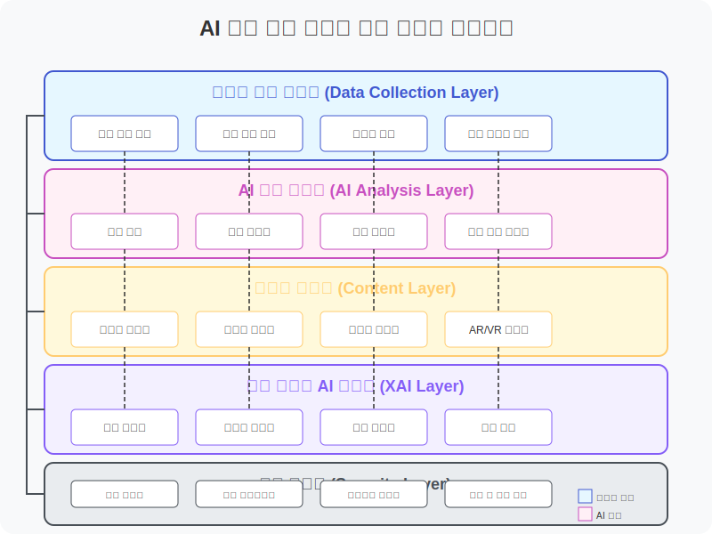

# 시스템 아키텍처

AI 기반 개인 맞춤형 학습 경로 추천 시스템의 아키텍처는 다양한 구성 요소와 모듈로 이루어져 있습니다. 이 문서에서는 시스템의 핵심 구조와 각 구성 요소의 역할, 그리고 데이터 흐름에 대해 설명합니다.

## 시스템 개요도

## 주요 구성 요소

시스템은 다음과 같은 5개의 주요 구성 요소로 이루어져 있습니다:

### 1. 데이터 수집 서브시스템

데이터 수집 서브시스템은 학습자로부터 다양한 데이터를 수집하고 전처리하는 역할을 담당합니다.

#### 주요 모듈:
- **생체 신호 수집 모듈**: 웨어러블 기기와 귀 삽입물 센서를 통해 뇌파(EEG), 심박수, 체온 등의 생체 신호를 실시간으로 수집합니다.
- **학습 활동 추적 모듈**: 학습자의 상호작용 패턴, 문제 풀이 시간, 오답률 등의 학습 활동 데이터를 수집합니다.
- **환경 데이터 수집 모듈**: 학습 환경의 조명, 소음, 온도 등의 환경 데이터를 수집합니다.
- **데이터 전처리 모듈**: 수집된 raw 데이터를 정규화하고 노이즈를 제거하여 분석에 적합한 형태로 변환합니다.

#### 기술 스택:
- 초고속 통신 프로토콜 (6G, 블루투스 5.3)
- 엣지 AI 하드웨어 (ARM Cortex-M55 기반)
- 임베디드 신호 처리 알고리즘
- TinyML 프레임워크

### 2. AI 학습 분석 및 경로 추천 서브시스템

수집된 데이터를 분석하여 학습자 모델을 구축하고, 최적의 학습 경로를 추천하는 시스템의 핵심 엔진입니다.

#### 주요 모듈:
- **학습자 모델링 엔진**: 학습자의 인지적 특성, 학습 스타일, 지식 수준, 선호도 등을 모델링합니다.
- **지식 그래프 관리자**: 학습 도메인의 개념들 간의 관계를 그래프 구조로 모델링합니다.
- **경로 생성 엔진**: 강화학습 기반의 알고리즘을 통해 개인화된 학습 경로를 생성합니다.
- **실시간 피드백 분석기**: 학습 과정에서 발생하는 피드백을 분석하여 경로를 동적으로 조정합니다.

#### 기술 스택:
- 딥러닝 프레임워크 (TensorFlow, PyTorch)
- 그래프 데이터베이스 (Neo4j)
- 강화학습 알고리즘 (PPO, A3C)
- 변형된 트랜스포머 모델

### 3. 학습 콘텐츠 제공 및 관리 서브시스템

추천된 학습 경로에 따라 적절한 학습 콘텐츠를 제공하고 관리하는 역할을 담당합니다.

#### 주요 모듈:
- **콘텐츠 저장소 관리자**: 다양한 형태의 학습 콘텐츠를 저장하고 관리합니다.
- **콘텐츠 적응 엔진**: 학습자의 특성에 맞게 콘텐츠의 난이도, 형식, 제시 방식 등을 조정합니다.
- **AI 콘텐츠 생성기**: 생성형 AI를 활용하여 개인화된 학습 콘텐츠를 실시간으로 생성합니다.
- **멀티모달 콘텐츠 변환기**: 같은 내용을 다양한 형태(텍스트, 이미지, 오디오, 비디오)로 제공할 수 있도록 변환합니다.

#### 기술 스택:
- 콘텐츠 관리 시스템 (Headless CMS)
- 생성형 AI 모델 (GPT-4, DALL-E 3)
- 멀티미디어 처리 라이브러리
- VR/AR 기술 (Unity, Unreal Engine)

### 4. 사용자 인터페이스 서브시스템

학습자, 교사, 학부모 등이 시스템과 상호작용할 수 있는 인터페이스를 제공합니다.

#### 주요 모듈:
- **대화형 AI 튜터**: 자연어 처리 기술을 활용한 대화형 인터페이스를 제공합니다.
- **학습 대시보드**: 학습 진행 상황, 성취도, 추천 경로 등을 시각화하여 보여줍니다.
- **AR/VR 학습 환경**: 몰입감 있는 학습 경험을 제공하는 증강/가상 현실 인터페이스입니다.
- **뇌-컴퓨터 인터페이스**: 생각만으로 시스템을 제어할 수 있는 혁신적인 인터페이스입니다.

#### 기술 스택:
- 웹 프레임워크 (React, Vue.js)
- 모바일 앱 개발 (Flutter, React Native)
- AR/VR SDK (ARKit, ARCore)
- BCI 기술 (OpenBCI)

### 5. 보안 및 프라이버시 보호 서브시스템

학습 데이터의 보안과 학습자의 프라이버시를 보호하는 역할을 담당합니다.

#### 주요 모듈:
- **동형 암호화 모듈**: 데이터를 암호화된 상태로 처리할 수 있도록 합니다.
- **차등 프라이버시 관리자**: 개인 정보 노출을 최소화하면서 유용한 통계 정보를 추출합니다.
- **블록체인 기반 학습 기록 관리자**: 학습 기록의 무결성을 보장합니다.
- **액세스 제어 및 인증 모듈**: 권한에 따른 데이터 접근을 제어합니다.

#### 기술 스택:
- 동형 암호화 라이브러리 (Microsoft SEAL)
- 차등 프라이버시 도구 (TensorFlow Privacy)
- 프라이빗 블록체인 (Hyperledger Fabric)
- OAuth 2.0, OpenID Connect

## 데이터 흐름도

시스템 내 데이터의 흐름은 다음과 같습니다:

1. **데이터 수집 단계**: 학습자의 생체 신호, 학습 활동, 환경 데이터가 수집되고 전처리됩니다.
2. **학습자 모델링 단계**: 전처리된 데이터를 바탕으로 학습자의 인지적 특성, 학습 스타일, 지식 수준 등이 모델링됩니다.
3. **경로 생성 단계**: 학습자 모델과 지식 그래프를 기반으로 최적의 학습 경로가 생성됩니다.
4. **콘텐츠 제공 단계**: 추천된 경로에 따라 적절한 학습 콘텐츠가 제공되고, 필요에 따라 실시간으로 생성됩니다.
5. **피드백 수집 단계**: 학습자의 반응, 성취도, 생체 신호 등의 피드백이 수집됩니다.
6. **경로 조정 단계**: 수집된 피드백을 바탕으로 학습 경로가 동적으로 조정됩니다.

## 배포 아키텍처

시스템은 하이브리드 클라우드 아키텍처를 기반으로 배포됩니다:

- **엣지 컴퓨팅 레이어**: 생체 신호 처리, 초기 데이터 전처리 등 지연 시간에 민감한 작업을 처리합니다.
- **프라이빗 클라우드 레이어**: 개인 데이터 분석, 학습자 모델링 등 민감한 정보를 처리합니다.
- **퍼블릭 클라우드 레이어**: 콘텐츠 저장, 대규모 모델 학습 등 컴퓨팅 리소스가 많이 필요한 작업을 처리합니다.

## 확장성 및 유연성

시스템은 모듈식 설계를 통해 높은 확장성과 유연성을 제공합니다:

- **마이크로서비스 아키텍처**: 각 구성 요소는 독립적인 마이크로서비스로 구현되어 개별적으로 확장 가능합니다.
- **API 기반 통합**: 표준화된 API를 통해 외부 시스템 및 서비스와 쉽게 통합할 수 있습니다.
- **플러그인 시스템**: 새로운 알고리즘, 모델, 콘텐츠 소스 등을 플러그인 형태로 쉽게 추가할 수 있습니다.

## 결론

AI 기반 개인 맞춤형 학습 경로 추천 시스템의 아키텍처는 최신 AI 기술과 교육 이론을 결합하여 학습자 개개인에게 최적화된 학습 경험을 제공합니다. 모듈식 설계와 최신 기술 스택을 통해 높은 확장성, 유연성, 보안성을 갖추고 있으며, 지속적인 개선과 발전이 가능합니다.